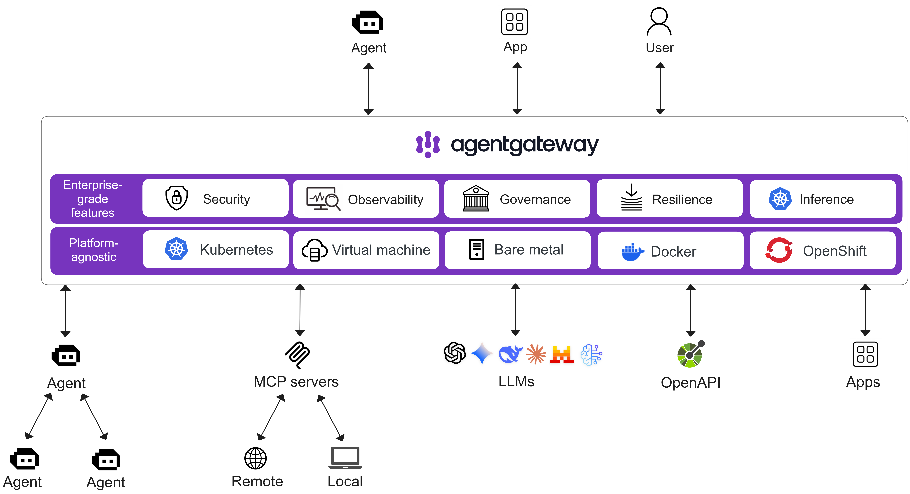
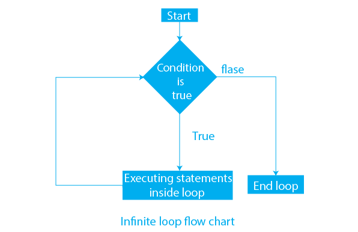
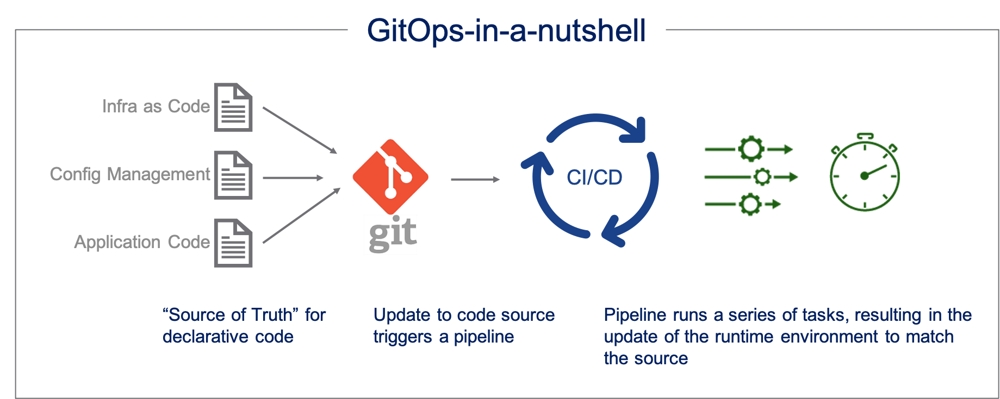
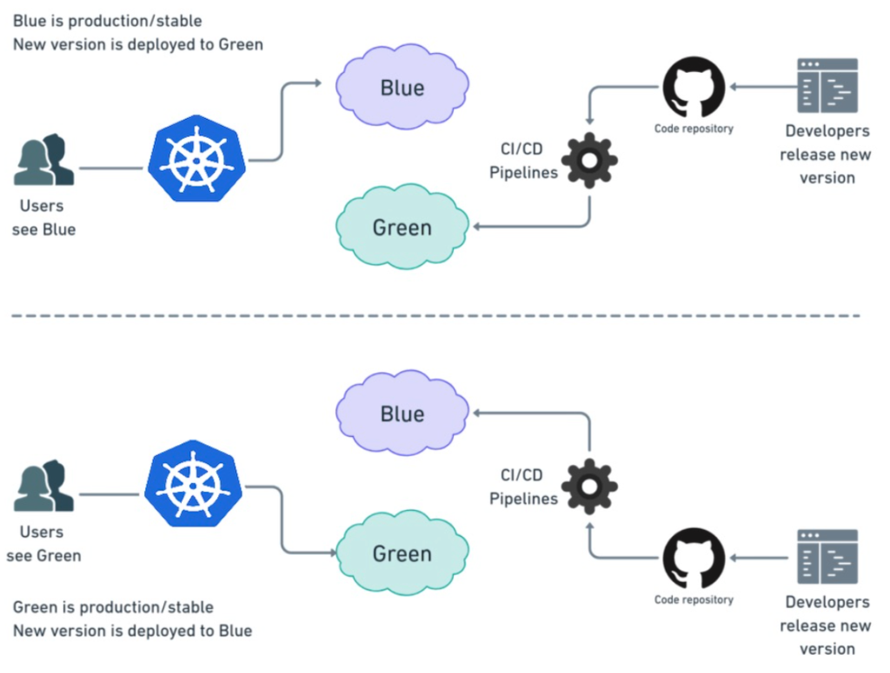
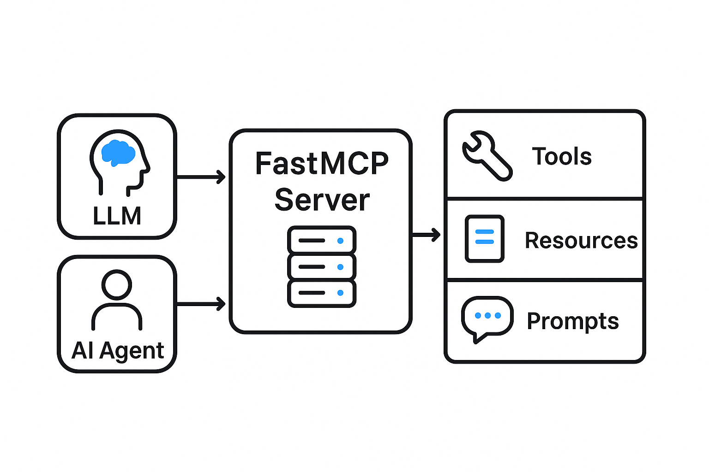
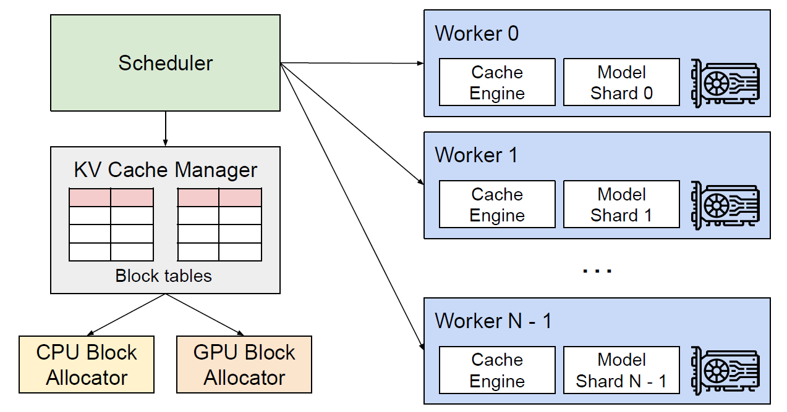
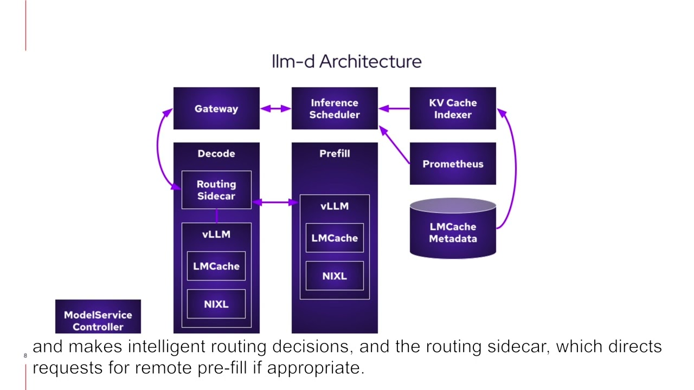

# Lab-7: Questions - AI Infrastructure Evaluation

This document contains answers to questions regarding our capabilities and the setup of our AI Reliability Engineering infrastructure.



---

## 1. How could we handle 'agent got stuck' scenarios?
### 1. Infrastructure Resilience

Here we use standard Cloud Native patterns:
- **Liveness/Readiness Probes**: 
  - Liveness: If the agent container hangs due to a memory leak or a deadlock in Python code, K8s will restart it.
  - Readiness: If the agent is currently loading a large vector database or indexes, it won't receive new requests until it's ready.
- **Circuit Breaker**: Used at the API Gateway level (e.g., Istio or kgateway). If the model (LLM API) is unresponsive or returns 5xx errors, the gateway stops sending requests to give the system a "rest" and avoid burning resources on futile attempts.

### 2. Agentic Loop Control
This is specific to AI. Even if the container is "healthy," the agent can fall into an Infinite Reasoning Loop (calling the same tool with the same parameters over and over).

#### Resolution Methods:
- **Max Iterations**: The simplest but most important safeguard. In the agent configuration (e.g., in LangChain or CrewAI), the `max_iterations=5` parameter is set. If the agent doesn't find an answer in 5 steps, it stops with an error.
- **Time-to-Live (TTL)** per request: Each agent task has a hard deadline. If the thought + action takes longer than N seconds, the session is aborted.
- **Self-Reflection**: Advanced agents have a "critique" step. Before each new iteration, the agent checks: "Have I done this already? Am I getting closer to the goal?" If there's no progress, it generates a stop signal itself.
#### Telemetry and Observability
OpenTelemetry (OTel) is critical here. But for AI, we monitor specific metrics:
- **Token Usage Velocity**: If too many tokens are burned in a short time, the agent is in a loop.
- **Tool Call Redundancy**: The frequency of calling the exact same API with identical arguments.
- **Trace Depth**: The nesting depth of the reasoning chain in Jaeger or Honeycomb.

---

## 2. Any automatic timeout/circuit breaker patterns coming out form this framework?
### 1. Circuit Breaker Pattern for LLM
In standard systems, we break the circuit when a service is "down". In AI agents, we extend this concept:
- **Rate Limit Exhaustion**: If the token limit (TPM/RPM) in OpenAI or Anthropic is exhausted, the Circuit Breaker at the `kgateway` level must trigger immediately without waiting for a timeout, so the agent doesn't waste resources on futile requests.
```yaml
policies:
  localRateLimit:
    - maxTokens: 10
      tokensPerFill: 1
      fillInterval: 60s
      type: requests
```
```yaml
policies:
    localRateLimit:
      - maxTokens: 10
        tokensPerFill: 1
        fillInterval: 60s
        type: tokens
```
more here: https://agentgateway.dev/docs/standalone/latest/configuration/resiliency/rate-limits/

- **Consecutive Failures**: If a tool called by the agent (e.g., a database query) returns an error 5 times in a row, the Gateway "isolates" this tool. The agent receives a clear response: "Tool X is temporarily unavailable," and instead of getting stuck, it can try another path (Plan "B").

### 2. Dynamic Timeouts
Unlike standard APIs, where the timeout is usually < 1s, LLM generation can take 30-60 seconds (especially with streaming or complex reasoning).
- **TTFT (Time To First Token) vs Overall Timeout**: HTTPRoute can be configured to wait 5 seconds for the first token, but allow the entire request to take up to 2 minutes. If the first token doesn't arrive, the timeout triggers.
- **Per-Tool Timeouts**: Every tool called by the agent must have its own timeout in the VirtualService. A Google search might take 3s, while a heavy SQL query takes 30s.
```yaml
timeout:
  requestTimeout: 1s
```
more here: https://agentgateway.dev/docs/standalone/latest/configuration/resiliency/timeouts/

### 3. "Graceful Degradation" Mechanism
When `kgateway` returns an error due to a Circuit Breaker trip, theoretically the agent has two paths:
- **Retry** with exponential backoff: This is configured directly in the K8s/Envoy logic.
```yaml
retry:
  # total number of attempts allowed.
  # Note: 1 attempt implies no retries; the initial attempt is included in the content.
  attempts: 3
  # Optional; if set, a delay between each additional attempt
  backoff: 500ms
  # A list of HTTP response codes to consider retry-able.
  # In addition, retries are always permitted if the request to a backend was never started.
  codes: [429, 500, 503]
```
more here: https://agentgateway.dev/docs/standalone/latest/configuration/resiliency/retries/

- **Fallback Logic**: If the primary (expensive/powerful) model is unavailable or drops due to a timeout, the Gateway can redirect the request to a lighter local model (e.g., Llama 3 via vLLM in the same cluster).

---

## 3. How does kgateway handle model failover?
**kgateway** for Model Failover at the infrastructure level solves one of the biggest reliability problems for AI agents - dependency on a specific API provider.
Let's analyze this mechanism from the perspective of a "resilient agent" architecture.

### 1. "Model Agnostic Agent" Concept
In theory, thanks to such a Gateway, we achieve a model-agnostic agent. The agent's code (its planning logic and tools) remains unchanged, while the infrastructure provides "fluidity" of computing resources.
 - Endpoint Abstraction: The agent calls a single internal URL (e.g., http://ai-gateway/v1/chat/completions), and **kgateway** decides exactly where this prompt goes.
 - Transparency to Logic: The agent doesn't even "know" that OpenAI is currently unavailable and its request is being handled by Claude or local Llama. This prevents the interruption of complex, multi-step reasoning chains.
 
### 2. Failover and SLA Strategies
In distributed systems theory, this can be configured under different scenarios:
- Strict Priority: Always use OpenAI until it returns an error $N$ times (Circuit Breaker), then switch.
- Latency-Based Routing: If the response from the cloud API becomes too slow (SLA time violation), the Gateway automatically redirects the request to a faster local model.
- Hedging: A more aggressive strategy where a request is sent simultaneously to two providers, and the agent receives the first response that arrives (latency minimization).

### 3. Local vLLM
Using vLLM in the cluster as a Tertiary provider is a critical element for Business Continuity:
- Internet Independence: Even if the backbone provider falls, the agent will continue to run on local capacities.
- Cost Control: When cloud API budget limits are reached, the Gateway can automatically "land" lower-priority tasks on the free local model.

---

## 4. Can we automatically switch from OpenAI to Claude to local model?
Using the failover capabilities of `kgateway`, we can configure priority-based routing constraints. The Gateway intercepts the standard API request and smoothly cascades through the backup pool: first it queries OpenAI, if unavailable or restricted it switches to Claude, and as the ultimate fallback - to a locally deployed model in Kubernetes, guided by dynamic availability and latency rules.

---

## 5. Could we seamlessly handle the response formats form these providers?
Yes. Modern AI Gateways (like `kgateway`) act as dynamic translation adapters that normalize API specifications. They convert, for example, the Messages API from Anthropic or local vLLM formats into a standard, unified format (most often the OpenAI-compatible standard API). This allows the agent's code to read and process responses in a single format, regardless of which provider physically executed the model.
This is called the **Agnostic Logic Layer**. When kgateway is used as a unifying proxy, essentially the "Adapter" pattern is implemented across the entire infrastructure level.

Let's break down the theoretical and practical challenges this normalization solves.

### 1. Syntactic Unification (Data Normalization)
Different providers have their own "dialects".
- Anthropic uses a messages structure with obligatory role alternation.
- OpenAI has its own specifics in tool_calls.
- vLLM or Ollama might have specific sampling parameters.

kgateway does the "dirty work" of mapping JSON fields. For your agent, this looks like one infinitely stable API.

### 2. The "Function Calling" Problem (Tool Use)
This is the hardest part of unification theory. Even if the JSON format is identical, models express the intent to call a function differently:
- Native Tool Use: Models like GPT-4o have special tokens for calling functions.
- Prompt-based Tool Use: Older or smaller local models (via vLLM) often require "instructions" in the system prompt to output JSON natively.
Theoretical advantage of the gateway: Advanced AI gateways can automatically inject necessary instructions (System Prompt Injection) for models that struggle with native function calling, bringing them up to the OpenAI standard.

### 3. Handling Errors and Status Codes
Different providers return different error codes for the exact same situations (e.g., Rate Limit):
- OpenAI: 429 Too Many Requests
- Anthropic: Also 429, but with a different response body.
The Gateway normalizes these errors. The agent sees a single StandardizedAIError, allowing the Retry logic (discussed earlier) to work predictably.

### 4. Semantic Discrepancy
Although the format (syntax) becomes uniform, the "brains" (semantics) remain different.
**Example:** We sent a prompt to OpenAI, it answered with a brief JSON. OpenAI went down, failover triggered to Anthropic via kgateway. The response format is exactly the same, but Anthropic might be more "chatty" or interpret the instruction differently.
This is what in AI agent theory is called the **Model Parity Problem**. To solve it, we use:
- **Pydantic Objects**: Validating the agent's response against a strict schema, regardless of the model.
- **Few-shot prompting**: Providing examples in the prompt to force different models to respond in the same predefined style.

## 6. Can we version the agents built form kagent?
Because `Kagent` deploys agents as Kubernetes **Custom Resource Definitions (CRDs)**, we treat the agents completely as **"Infrastructure as Code"**. We can version these YAML manifests in **Git (GitOps)** using **FluxCD**. Every update to the system prompt, tools, or LLM configurations gets its own version, undergoes code review via Pull Requests, and is rolled out exactly like standard microservices.


## 7. Any blue/green or canary deployment patterns for agents?
Using Kubernetes-native routing (Gateway API / Service Mesh), we can implement blue/green or canary deployments. We can deploy `v2` of the `Agent` resource and configure `kgateway` to direct a small percentage (e.g., 5-10%) of the inference traffic to the new agent iteration. Once we confirm successful tool usage and acceptable result quality, we can gradually increase traffic to 100%.


## 8. What's the fastmcp-python framework mentioned?
`fastmcp` is a high-level Python framework designed for rapid development of applications based on the Model Context Protocol (MCP). It allows developers to create complex MCP servers, tools, and resources simply by adding Python decorators (e.g., `@mcp.tool`) to standard Python functions. This abstracts and hides the complex interactions with the JSON-RPC protocol lifecycle.



## 9. Is it the easiest path to mcp?
Yes, it significantly lowers the barrier to entry because developers no longer need to manually implement WebSockets protocols, SSE headers, or write JSON schemas themselves. Similar to how FastAPI radically simplified creating REST APIs, `FastMCP` automates the creation of tool bindings and type checking, providing the most "developer-friendly" experience for connecting Python functions to LLMs via MCP.

## 10. About finops: how much control I can have?
AI FinOps, when dynamically integrated at the AI Gateway level, provides granular visibility and operational control. You have full control over which agents or specific users possess the rights to invoke certain models. You can program hard budgets, limit traffic (throttling), and establish strict usage quotas based on extracted metadata (tags).

## 11. Token level / per agent level
You get native monitoring and control capabilities at both levels. Because every single interaction must pass through the AI Gateway, this gateway logs detailed metrics (the number of Input/Output tokens sent and received) and attributes them against HTTP headers, JWT claims, or metadata representing a specific `Agent` or `Tenant`.

## 12. Can I implement custom cost controls?
Yes. Using advanced API Gateways, you can integrate custom validators (e.g., External Auth or WASM plugins) that will evaluate cost policies prior to routing the request itself. **For example:** if a specific agent has exceeded its daily monetary limit, the Gateway will intercept the prompt and instantly throw an HTTP 403 Forbidden error. You can also intervene with transactions in-flight, restricting the `max_tokens` value or blocking invocations of overly expensive tools.

## 13. Per-agent budgets or depth of Token limits
Both parameters are fully configurable. Aggregated limits act as a shared "budget" for the agent over time. However, "depth of Token limits" (limit by transaction size/depth) establishes a "ceiling" for an individual transaction (e.g., an agent is allowed to make a request, but the gateway will immediately reject a prompt whose size exceeds 10,000 tokens), safeguarding your budget from a massive, sudden one-time drain by a single huge prompt.

## 14. vLLM suitable for agents with many back and forth tool calls, or is it better for single shot inference?
**vLLM** is phenomenally suited for agentic workloads (where many back-and-forth steps or tool calls occur), primarily thanks to a feature called **Automatic Prefix Caching** in addition to PagedAttention. In agentic chains, the system prompt and history grow rapidly and are constantly repeated. Prefix caching allows the vLLM engine to completely cache the previous multi-turn conversation context, nearly eliminating the need for redundant prefill computations. This dramatically accelerates generation times during repeated agent loops, making it an ideal choice.



## 15. llm-d's scheduler - helps when agents makes 15 llms calls?
The `llm-d` scheduler, functioning as an intelligent distributed scheduler layer, truly shines in this case thanks to Inference-Aware Routing. When an agent executes a loop of 15 repeating LLM calls, standard load balancers scatter the requests across different pods/clusters randomly. The `llm-d` scheduler ensures that the agent's subsequent loops hit the exact node/GPU where the context from the previous call already resides in the KV-cache. This prevents "cache-thrashing" (cache loss), saves immense GPU utilization, and allows processing 15 back-and-forth requests with incredibly low latency.


